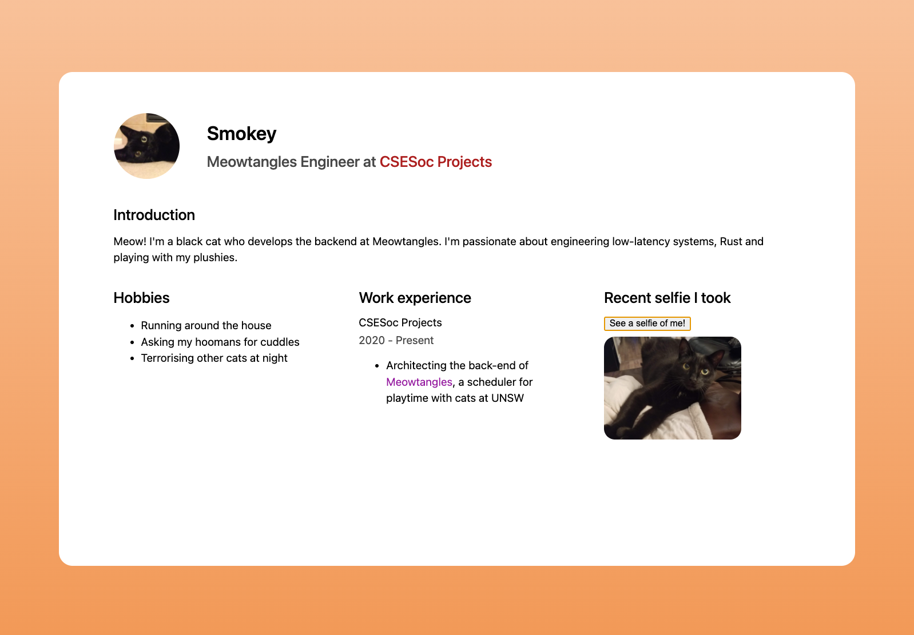

# Example profile page



> **Live demo**: https://trainee-5-profile-example.vercel.app

This profile page demonstrates the use of

- HTML and CSS to render and style content on a webpage
- Good use of meta / accessibility / text tags to provide semantic context
- CSS Flexbox and Grid to layout elements
- Basic JavaScript to add interactivity

A guided tutorial from [Jeffrey](https://github.com/jeffreydyao) can be found [here](https://www.loom.com/share/2dec5e825f3e4c0b9ea1a8ebdcd0871e).

> This page is **not responsive** (desktop-only) as it demonstrates basic web concepts only. Responsive layouts are critical to modern web development. Responsive means the site layout adapts across different devices (breakpoints), i.e. mobile, table, desktop. A good tutorial is [here](https://developer.mozilla.org/en-US/docs/Learn/CSS/CSS_layout/Responsive_Design). **In general, design mobile-first.**

## Get started

### Option 1: Download the folder as a ZIP

Download [here](https://downgit.github.io/#/home?url=https://github.com/csesoc/2022-trainee-5/tree/main/week-01-02-profile-pages/example), unzip, then open `index.html` in a web browser.

### Option 2: Clone the repo

Clone the repo.

```bash
# Using Git
git clone https://github.com/csesoc/2022-trainee-5.git
# Using GitHub CLI
gh repo clone csesoc/2022-trainee-5
```

Navigate to the `example` folder.

```bash
cd week-01-02-profile-pages/example
```

Open `index.html` in a web browser.

## Code / scripts used in this example

### Emojisplosion

A JavaScript script that adds emoji explosions to your page.
[GitHub](https://github.com/JoshuaKGoldberg/emojisplosion)

### One-liner to add an emoji vector favicon

Insert in the `<head>` tag of your site.

```html
<link
  rel="icon"
  href="data:image/svg+xml,<svg xmlns=%22http://www.w3.org/2000/svg%22 viewBox=%220 0 100 100%22><text y=%22.9em%22 font-size=%2290%22>🎯</text></svg>"
/>
```

[CSS-Tricks](https://css-tricks.com/emoji-as-a-favicon/)
